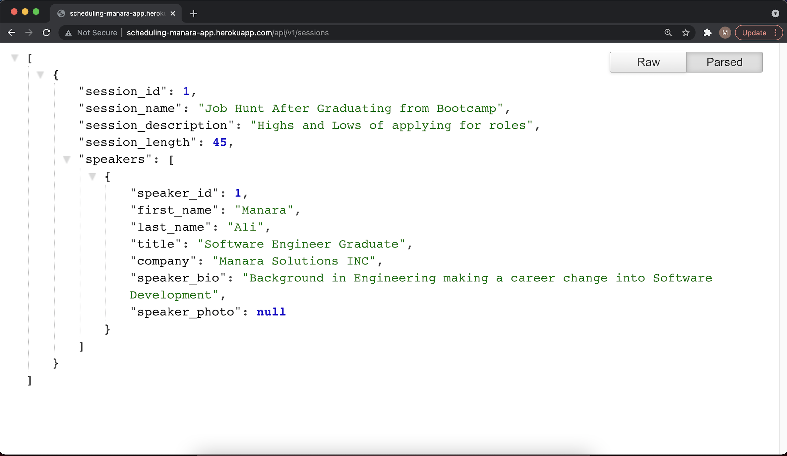

# Scheduling-app
This is an application that allows newly bootcamp graduates such as myself book a spot in our virtual Ted Talks regarding the difficulties 
they are faced with after graduating from the coding bootcamp and looking for roles in the tech industry.

## Overview
This is a fully functioning CRUD application API that allows my friends and I book virtual Talks to talk about each other experience in our job seach and
give pointers on what worked and what did not for each roles we might have applied for

## Link to the API
http://scheduling-manara-app.herokuapp.com/api/v1/sessions

## Application Image

## Technologies
The technologies used for this application are Java, Springboot as my backend, Postgresql as my database and Heroku as my host with Postman as my backend tester
